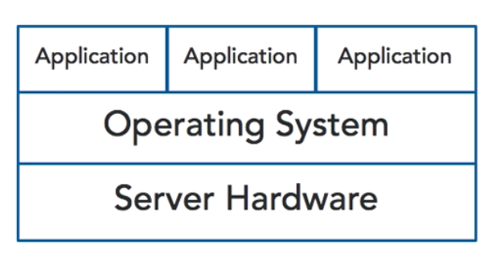
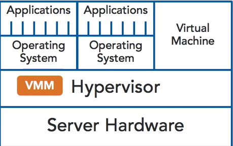

## Virtualization:

We'll be using Oracle VirualBox:

### Benefits:

- Allows simple setup of testing enviroment(lab)
- Ensures containment of testing activity to the lab.
- Allows roll back after malware infection (using snapshots)

Let's see the different approaches of Virtualization

### Hardware Virutalization

The basic structure of a computer is a hardware layer on top of which sets the operating system, the OS **directly** interact with the computer hardware and control how the hardware is accessed
on top of OS are the applications which take advantage of the OS and through the OS ofcourse the hardware resources



For a native hardware virutalizer system, there is another layer called the 'Hypervisor' which sets on top of the hardware, this provides set of hardware on top sets many OSs
these OSs are called Virutal Machine (VM)
The Hypervisor manages the virualization of input/output services mappping the virual machine devices to the hardware devices
an example of this Micorsoft Hyper-V Hypervisor which introducted with windows server 2012
the hypervisor includes `VMM` a virtual machine mangager, which can be used to stop and start VMs and control how they operate


Read more about 'Hyper-V'

### Software Virtualization

In this approach, the VMM operates as standalone application of host operating system

- Privileged opertaiong carried out by VM-safe routines:
  - Code Scanning and Analysis Manager(VirualBox)
  - Real-time Patch Manager (which replace un-safe code with safe-code routine)
- Hardware-assisted virualization (Intel VT-x process -> enable the virual machines to maintain their own address space and deliver additional performance)
  There are so many providers:
  -VMware
  -VirualBox
  -Parallels (for Mac systems)

\*\* Whatis

- Metasploit: contains database of known vulen in form of exploits that can be run against a target to see if it's vulenrable
- armitage : provide GUI of managing targets as well as metasploit console
- Burpsuite: Web Proxy
- Maltego: Information gathering tool
- beef xxs framework
- faraday ide
- Keep exploring the enviroment

\*\* screen settings

- turn off (Automatic suspend and make Blank scree (Never))
- from privacy (turn off screen lock)

\*\* know the version of kali

```bash
lsb_release -a
```
